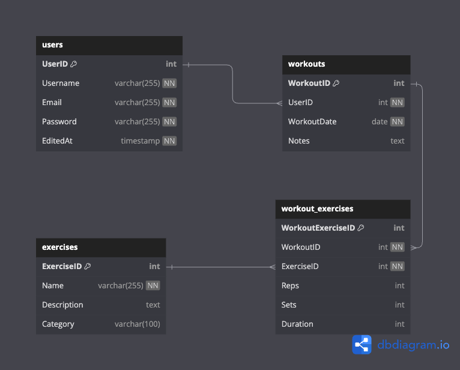

# Exercise Armory

## Goal

My goal is to create a web application to allow users to access information on different exercises as well as create and track progress for different workouts. 

## Tech Stack

- **Database**: Postgresql
- **Backend**: Node.js, Express
- **Authentication**: Bcrypt
- **Frontend**: React, Axios

## Data

I plan on collecting exercise data from the [exerciseDB](https://rapidapi.com/justin-WFnsXH_t6/api/exercisedb/) api. You can view my DB schema in the DBschema file in this repository.

## Outline

### 1. User Authentication
- **Sign Up/Login:** Allow users to create an account
- **User Profile:** Include personal information, and workouts.

### 2. Workout Tracking
- **Workout Log:** Users can log their workouts, including exercise type, duration, repetitions, sets, and weight.
- **Custom Workouts:** Allow users to create and save custom workout routines.

### 3. Exercise Library
- **View Exercises** Provide a database of exercises with descriptions, images demonstrating proper form.

### 3. Progress Tracking
- **Graphs and Charts:** Visual representation of progress over time for metrics such as weight lifted, distance run, or body measurements.
- **Statistics:** Summarize key statistics like total workouts, average duration, total weight lifted, etc.

### 4. Stretch Goals
- **Statistics:** Summarize key statistics like total workouts, average duration, total weight lifted, etc.
- **Goal Management:** Users can set fitness goals (e.g., running a certain distance, lifting a certain weight) and track their progress towards them.
- **Reminders and Notifications:** Send notifications to remind users to work out or update their progress.
- **Friends and Followers:** Users can connect with friends to share progress and motivate each other.
